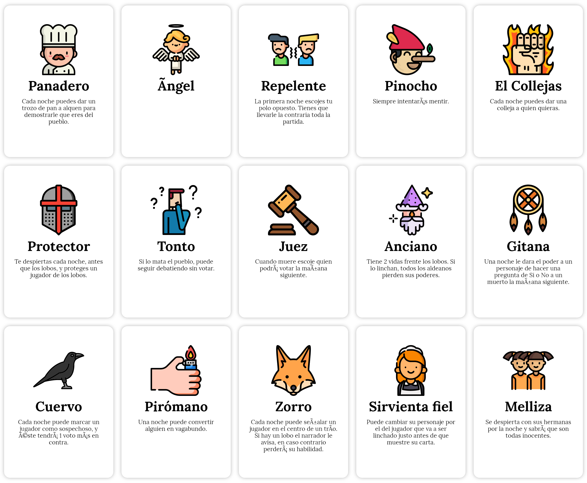

# El Lobo - Juego de cartas

Takes the JSONs inside `data` folder and generates [dist/deck.pdf](dist/deck.pdf) and [dist/deck.html](dist/deck.html) with the deck of cards.



## Commands

### Intall

```bash
sudo apt-get install libfontconfig
npm i
```

### Run

```bash
npm start
```

## Resources

We use [Flat Icon](https://www.flaticon.com) images and [Explorer Font](https://www.behance.net/gallery/78419793/Free-Font-Explorer)

### Aldeanos

[https://www.flaticon.com/packs/avatar-63](https://www.flaticon.com/packs/avatar-63)
[https://www.flaticon.com/packs/profession-avatars-5](https://www.flaticon.com/packs/profession-avatars-5)

## Ideas

policia: manda a la carzel a quien quiere y este no puede hablar hasta el siguiente dia.

## TODO list

- Cambiar descripcións a primera persona (que es dirigeixi a qui la llegeix)
- Buscar imatges
- Actualitzar rol, identitat, ofici... (types) - Equipo (rodoneta adalt)
- Posar els oficis

## Example Cards


